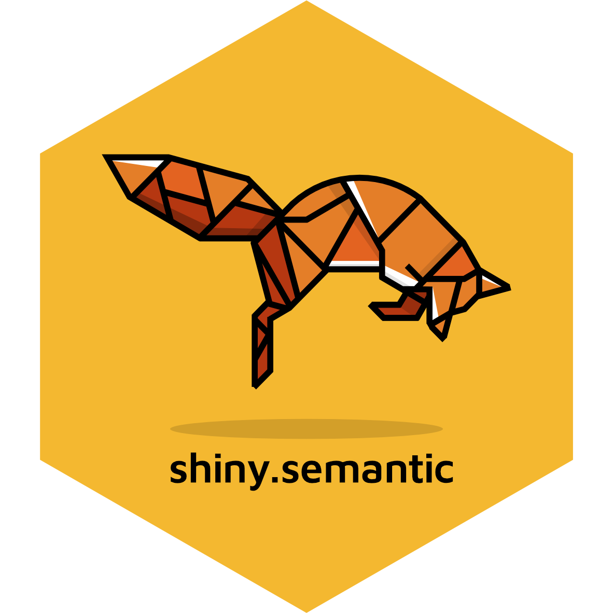

shiny.semantic
==============



**Semantic UI wrapper for Shiny**

<!-- badges: start -->
[](https://travis-ci.org/Appsilon/shiny.semantic) 
[](https://codecov.io/gh/Appsilon/shiny.semantic)

[](https://CRAN.R-project.org/package=shiny.semantic)
[](https://CRAN.R-project.org/package=shiny.semantic)
<!-- badges: end -->

With this library it's easy to wrap Shiny with [Semantic UI components](https://github.com/Semantic-Org/Semantic-UI). Add a few simple lines of code and some CSS classes to give your UI a fresh, modern and highly interactive look.

`master` branch contains the stable version. Use `develop` branch for latest features.

<h2>
Before
</h2>


<h2>
After
</h2>


Component examples
------------------


<p style="text-align: center; font-size: x-large;">
<a href="https://demo.appsilon.ai/semantic/">Components live demo</a>
</p>
The source code for **Components live demo** is located in **/examples** folder. To run it locally you will have to install:

-   [**highlighter**](https://github.com/Appsilon/highlighter)

        devtools::install_github("Appsilon/highlighter")

Check out also our dashboard examples made with **shiny.semantic** library:

1.  [Churn analytics](https://demo.appsilon.ai/churn)
2.  [Fraud detection](https://demo.appsilon.ai/frauds)

How to install?
---------------

You can install stable `shiny.semantic` release from CRAN repository:

    install.packages("shiny.semantic")

To install [previous versions]() you can run:

    devtools::install_github("Appsilon/shiny.semantic", ref = "0.1.0")

How to use it?
--------------

Firstly, you will have to invoke `shinyUI()` with `semanticPage()` instead of standard Shiny UI definitions like e.g. `fluidPage()`. From now on forward all components can ba annotated with [Semantic UI](http://semantic-ui.com/introduction/getting-started.html) specific CSS classes and also you will be able to use [shiny.semantic components](https://demo.appsilon.ai/semantic/).

Basic example for rendering a simple button. will look like this:

``` r
library(shiny)
library(shiny.semantic)
ui <- function() {
  shinyUI(
    semanticPage(
      title = "My page",
      suppressDependencies("bootstrap"),
      div(class = "ui button", uiicon("user"),  "Icon button")
    )
  )
}
server <- shinyServer(function(input, output) {
})
shinyApp(ui = ui(), server = server)
```

For better understanding it's good to check [Semantic UI documentation.](http://semantic-ui.com/introduction/getting-started.html)

**Note \#1**

At the moment you have to pass page title in `semanticPage()`

    semanticPage(title = "Your page title", ...)

**Note \#2**

There are some conflicts in CSS styles between **SemanticUI** and **Bootstrap**. For the time being it's better to suppress **Bootstrap** by caling: `semanticPage(   ...   suppressDependencies("bootstrap"),   ... )`

**\[Advanced\] Using Semantic UI JavaScript elements**

Some Semantic UI elements require to run a specific JS code when DOM document is ready. There are at least 2 options to do this:

1.  Use [shinyjs](https://github.com/daattali/shinyjs)

<!-- -->

    library(shinyjs)
    ...
    jsCode <- " # Semantic UI componts JS "
    ...
    ui <- function() {
      shinyUI(
        semanticPage(
          title = "Your page title",
          shinyjs::useShinyjs(),
          suppressDependencies("bootstrap"),
          # Your UI code
        )
      )
    }
    server <- shinyServer(function(input, output) {
      runjs(jsCode)
      # Your Shiny logic
    })
    shinyApp(ui = ui(), server = server)

1.  Use `shiny::tags$script()`

<!-- -->

    ...
    jsCode <- "
    $(document).ready(function() {
      # Semantic UI components JS code, like:
      #$('.rating').rating('setting', 'clearable', true);
      #$('.disabled .rating').rating('disable');
    })
    ...
    "

    ui <- function() {
      shinyUI(
        semanticPage(
          title = "My page",
          tags$script(jsCode),
          suppressDependencies("bootstrap"),
          # Your UI code
        )
      )
    }
    ...
    server <- shinyServer(function(input, output) {
      # Your Shiny logic
    })

    shinyApp(ui = ui(), server = server)

How to contribute?
------------------

If you want to contribute to this project please submit a regular PR, once you're done with new feature or bug fix.<br>

**Changes in documentation**

Both repository **README.md** file and an official documentation page are generated with Rmarkdown, so if there is a need to update them, please modify accordingly a **README.Rmd** file and use "Knit".

Documentation is rendered with `pkgdown`. Just run `pkgdown::build_site()` after rendering new **README.md**.

Troubleshooting
---------------

We used the latest versions of dependencies for this library, so please update your R environment before installation.

However, if you encounter any problems, try the following:

1.  Up-to-date R language environment
2.  Installing specific dependent libraries versions

-   shiny

        install.packages("shiny", version='0.14.2.9001')

1.  Some bugs may be related directly to Semantic UI. In that case please try to check issues on its [repository.](https://github.com/Semantic-Org/Semantic-UI)
2.  Some bugs may be related to **Bootstrap**. Please make sure you have it suppressed. Instructions are above in **How to use it?** section.

Future enhacements
------------------

-   create all update functions for input components to mimic shiny as close as possible
-   add some glue code in dsl.R to make using this package smoother
-   adding more semantic componenets
-   new version release on CRAN

Appsilon Data Science
---------------------

Appsilon is the **Full Service Certified RStudio Partner**. Learn more at [appsilon.com](https://appsilon.com).

Get in touch [dev@appsilon.com](dev@appsilon.com)
