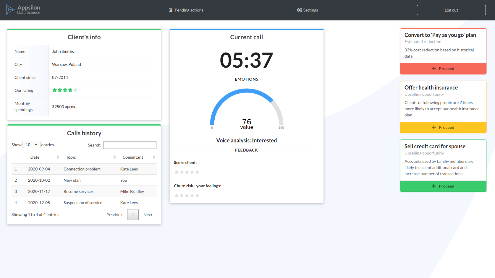
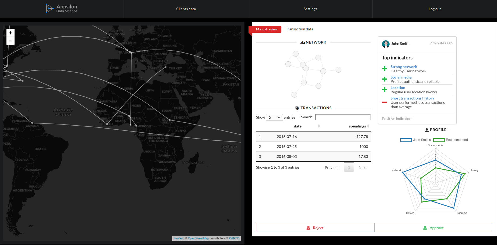

# shiny.semantic

<!-- badges: start -->


[](https://codecov.io/gh/Appsilon/shiny.semantic)

[](https://CRAN.R-project.org/package=shiny.semantic)
[](https://CRAN.R-project.org/package=shiny.semantic)
<!-- badges: end -->

**Fomantic (Semantic) UI wrapper for Shiny**

With this library it is easy to wrap Shiny with **[Fomantic
UI](https://fomantic-ui.com/)** (previously *Semantic*). Add a few
simple lines of code to give your UI a **fresh, modern and highly
interactive** look.

  - **shiny**


``` r
library(shiny)
ui <- fluidPage(
  div(
    div(
      a("Link"),
      p("Lorem ipsum, lorem ipsum, lorem ipsum"),
      actionButton("button", "Click")
    )
  )
)
```

  - **shiny.semantic**


``` r
library(shiny.semantic)
ui <- semanticPage(
  div(class = "ui raised segment",
    div(
      a(class="ui green ribbon label", "Link"),
      p("Lorem ipsum, lorem ipsum, lorem ipsum"),
      actionButton("button", "Click")
    )
  )
)
```

## Shiny.semantic demos

### Case studies

| [:link: Churn analytics](https://demo.appsilon.ai/churn) | [:link: Fraud detection](https://demo.appsilon.ai/frauds) |
| :------------------------------------------------------: | :-------------------------------------------------------: |
|   |    |

### Before and after

We show how `shiny.semantic` can be used to style an app and change it’s
look.

| [:link: BEFORE Utah Division of Water Quality (DWQ)](https://shiny.rstudio.com/gallery/lake-profile-dashboard.html) | [:link: AFTER Utah Division of Water Quality (DWQ)](https://demo.appsilon.ai/apps/water-quality/) |
| :-----------------------------------------------------------------------------------------------------------------: | :-----------------------------------------------------------------------------------------------: |
|                                                          |                                         |

## Component examples

<center>

<h3>

<a href="https://demo.appsilon.ai/semantic/">Components live demo</a>

</h4>

</center>

See more examples with code in the `examples` folder:

  - [Static Semantic components
    demo](https://github.com/Appsilon/shiny.semantic/blob/develop/examples/app.R)
  - [Calendar date and month demo with
    update](https://github.com/Appsilon/shiny.semantic/blob/develop/examples/calendar/app.R)
  - [Counter button
    demo](https://github.com/Appsilon/shiny.semantic/blob/develop/examples/counter_button/app.R)
  - [Custom CSS
    demo](https://github.com/Appsilon/shiny.semantic/blob/develop/examples/customcss/app.R)
  - [Dropdown update
    demo](https://github.com/Appsilon/shiny.semantic/blob/develop/examples/dropdown_updates/app.R)
  - [Form inputs
    demo](https://github.com/Appsilon/shiny.semantic/blob/develop/examples/form_inputs/app.R)
  - [Modal
    demos](https://github.com/Appsilon/shiny.semantic/tree/develop/examples/modal)
  - [Multiple checkbox
    demo](https://github.com/Appsilon/shiny.semantic/blob/develop/examples/multiple_checkbox/app.R)
  - [Rating with update
    demo](https://github.com/Appsilon/shiny.semantic/blob/develop/examples/rating/app.R)
  - [Search selection
    demos](https://github.com/Appsilon/shiny.semantic/tree/develop/examples/search_selection)
  - [Shiny numericInput
    demo](https://github.com/Appsilon/shiny.semantic/blob/develop/examples/shiny_syntax/numericInput.R)
  - [Shiny selectInput
    demo](https://github.com/Appsilon/shiny.semantic/blob/develop/examples/shiny_syntax/selectInput.R)
  - [Shiny fileInput
    demo](https://github.com/Appsilon/shiny.semantic/blob/develop/examples/shiny_syntax/fileInput.R)
  - [Slider and range with update
    demo](https://github.com/Appsilon/shiny.semantic/blob/develop/examples/shiny_syntax/selectInput.R)
  - [Multiple tab
    demo](https://github.com/Appsilon/shiny.semantic/blob/develop/examples/tabset/app.R)
  - [Notification
    demo](https://github.com/Appsilon/shiny.semantic/blob/develop/examples/toast/app.R)

## How to install?

You can install a stable `shiny.semantic` release from CRAN repository:

``` r
install.packages("shiny.semantic")
```

and the latest version with `remotes`:

``` r
remotes::install_github("Appsilon/shiny.semantic@develop")
```

(`master` branch contains the stable version. Use `develop` branch for
latest features)

To install [previous versions]() you can run:

``` r
remotes::install_github("Appsilon/shiny.semantic", ref = "0.1.0")
```

## How to use it?

Firstly, you will have to invoke `shinyUI()` with `semanticPage()`
instead of standard Shiny UI definitions like e.g. `bootstrapPage()`.
From now on, all components can be annotated with [Fomantic
UI](https://fomantic-ui.com/) specific CSS classes and also you will be
able to use [shiny.semantic
components](https://demo.appsilon.ai/semantic/).

Basic example for rendering a simple button. will look like this:

``` r
library(shiny)
library(shiny.semantic)
ui <- semanticPage(
      title = "My page",
      div(class = "ui button", icon("user"),  "Icon button")
    )
server <- function(input, output) {}
shinyApp(ui, server)
```

For better understanding it’s good to check [Fomantic UI
documentation.](https://fomantic-ui.com/)

**Note \#1**

At the moment you have to pass page title in `semanticPage()`

    semanticPage(title = "Your page title", ...)

**Note \#2**

The `shiny` package works with **Bootstrap** library under the hood.
`shiny.semantic` uses [Fomantic UI](https://fomantic-ui.com/). Sometimes
using both of these libraries may cause troubles with rendering specific
UI elements. That is why by default we turn off Bootstrap dependencies.

However, you can switch off suppressing bootstrap by calling
`semanticPage(suppress_bootstrap = FALSE, ...)`

## How to contribute?

We welcome contributions of all types\!

We encourage typo corrections, bug reports, bug fixes and feature
requests. Feedback on the clarity of the documentation and examples is
especially valuable.

If you want to contribute to this project please submit a regular PR,
once you’re done with new feature or bug fix.<br>

**Changes in documentation**

Both repository **README.md** file and an official documentation page
are generated with Rmarkdown, so if there is a need to update them,
please modify accordingly a **README.Rmd** file and use “Knit”.

Documentation is rendered with `pkgdown`. Just run
`pkgdown::build_site()` after rendering new **README.md**.

**Changes in vignettes**

If you modified or added a new vignette, please rebuild them with
`devtools::build_vignettes()`.

*Important:*

1)  Please follow the code style from out
    [styleguide](https://github.com/Appsilon/shiny.semantic/blob/develop/STYLEGUIDE.md).

2)  We have a Contributor [Code of Conduct](). Make sure to check it and
    to follow it.

## Troubleshooting

We used the latest versions of dependencies for this library, so please
update your R environment before installation.

However, if you encounter any problems, try the following:

1.  Up-to-date R language environment
2.  Installing specific dependent libraries versions

<!-- end list -->

  - shiny

<!-- end list -->

``` r
install.packages("shiny", version='0.14.2.9001')
```

3.  Some bugs may be related directly to Semantic UI. In that case
    please try to check issues on its
    [repository.](https://github.com/fomantic/fomantic-ui)
4.  Some bugs may be related to **Bootstrap**. Please make sure you have
    it suppressed. Instructions are above in **How to use it?** section.

## Future enhacements

  - create all update functions for input components to mimic shiny as
    close as possible
  - add some glue code in `dsl.R` to make using this package smoother
  - adding more semantic components
  - new version release on CRAN

## Appsilon Data Science


Appsilon is the **Full Service Certified RStudio Partner**. Learn more
at [appsilon.com](https://appsilon.com).

Get in touch [dev@appsilon.com](dev@appsilon.com)
