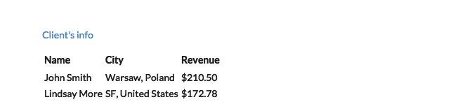
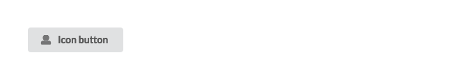
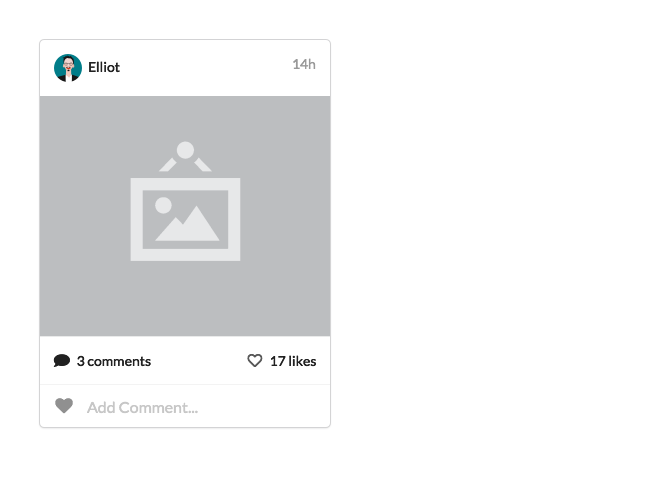

<link href="http://fonts.googleapis.com/css?family=Lato:300,700,300italic|Inconsolata" rel="stylesheet" type="text/css">

<link href='inst/assets/styles/style.css' rel='stylesheet' type='text/css'>

shiny.semantic
==============

Semantic UI wrapper for Shiny

With this library it's easy to wrap Shiny with [Semantic UI components](https://github.com/Semantic-Org/Semantic-UI). Add a few simple lines of code and some CSS classes to give your UI a fresh, modern and highly interactive look.

<h2>
Before
</h2>
 

<h2>
After
</h2>
 

<!-- #Basic tutorial article is available on [Appsilon Data Science blog](your_future_art_link). -->
<!-- Live demo link below -->
<!-- TODO Analogy to http://shiny.rstudio.com/gallery/widget-gallery.html -->

<a href="http://demo.appsilondatascience.com/shiny.semantic/components">Components live demo</a>

Source code
-----------

This library source code can be found on [Appsilon Data Science's](http://appsilondatascience.com) Github:   <https://github.com/Appsilon/shiny.semantic>

How to install?
---------------

**Note! This library is still in its infancy. Api might change in the future.**

At the moment it's possible to install this library through [devtools](https://github.com/hadley/devtools).

    devtools::install_github("Appsilon/shiny.semantic")

To install [previous version]() you can run:

    devtools::install_github("Appsilon/shiny.semantic", ref = "0.1.0")

How to use it?
--------------

Firstly, you will have to invoke *shinyUI()* with *semanticPage()* instead of standard Shiny UI definitions like e.g. *fluidPage()*. From now on forward all components can ba annotated with [Semantic UI](http://semantic-ui.com/introduction/getting-started.html) specific CSS classes and also you will be able to use [shiny.semantic components](http://demo.appsilondatascience.com/shiny.semantic/components).

Basic example will look like this:

    library(shiny)
    #devtools::install_github("Appsilon/shiny.semantic")
    library(shiny.semantic)

    ui <- function() {
      shinyUI(
        semanticPage(
          title = "My page",
          suppressDependencies("bootstrap"),
          div(class = "ui button", uiicon("user"),  "Icon button")
        )
      )
    }

    server <- shinyServer(function(input, output) {
    })

    shinyApp(ui = ui(), server = server)

and will render a simple button. 

For better understanding it's good to check [Semantic UI documentation.](http://semantic-ui.com/introduction/getting-started.html)

**Note \#1**

At the moment you have to pass page title in *semanticPage()*

    semanticPage(title = "Your page title", ...)

**Note \#2**

There are some conflicts in CSS styles between **SemanticUI** and **Bootstrap**. For the time being it's better to suppress **Bootstrap** by caling:

    semanticPage(
          ...
          suppressDependencies("bootstrap"),
          ...
          )

**\[Advanced\] Using Semantic UI JavaScript elements**

Some Semantic UI elements require to run a specific JS code when DOM document is ready. There are at least 2 options to do this:

1.  Use [shinyjs](https://github.com/daattali/shinyjs)

<!-- -->

    library(shinyjs)
    ...
    jsCode <- " # Semantic UI componts JS "
    ...
    ui <- function() {
      shinyUI(
        semanticPage(
          title = "Your page title",
          shinyjs::useShinyjs(),
          suppressDependencies("bootstrap"),
          # Your UI code
        )
      )
    }

    server <- shinyServer(function(input, output) {
      runjs(jsCode)
      # Your Shiny logic
    })

    shinyApp(ui = ui(), server = server)

1.  Use *shiny::tags$script()*

<!-- -->

    ...
    jsCode <- "
    $(document).ready(function() {
      # Semantic UI components JS code, like:
      #$('.rating').rating('setting', 'clearable', true);
      #$('.disabled .rating').rating('disable');
    })
    ...
    ui <- function() {
      shinyUI(semanticPage(
        title = "My page",
        tags$script(jsCode),
        suppressDependencies("bootstrap"),
        # Your UI code
        )
      )
    }
    ...
    server <- shinyServer(function(input, output) {
      # Your Shiny logic
    })

    shinyApp(ui = ui(), server = server)
        

Component examples
------------------

-   **Raised segment with list**

 <!--html_preserve-->
<pre>
<code class="r">div(class = "ui raised segment", div(class = "ui relaxed divided list", c("Apples", 
    "Pears", "Oranges") %&gt;% purrr::map(~div(class = "item", uiicon("large github middle aligned"), 
    div(class = "content", a(class = "header", "Hello"), div(class = "description", 
        .))))))</code>
</pre>

<!--/html_preserve-->
-   **Interactive card**

 <!--html_preserve-->
<pre>
<code class="r">div(class = "ui card", div(class = "content", div(class = "right floated meta", "14h"), 
    img(class = "ui avatar image", src = "http://semantic-ui.com/images/avatar/large/elliot.jpg"), 
    "Elliot"), div(class = "image", img(src = "http://semantic-ui.com/images/wireframe/image.png")), 
    div(class = "content", span(class = "right floated", uiicon("heart outline like"), 
        "17 likes"), uiicon("comment"), "3 comments"), div(class = "extra content", 
        div(class = "ui large transparent left icon input", uiicon("heart ouline"), 
            tags$input(type = "text", placeholder = "Add Comment..."))))</code>
</pre>

<!--/html_preserve-->
All components examples can be found here:  <http://demo.appsilondatascience.com/shiny.semantic/components>

The source code for **Components live demo** is located in **/examples** folder. To run it locally you will have to install:

-   [**highlighter**](https://github.com/Appsilon/highlighter)

        devtools::install_github("Appsilon/highlighter")

Check out also our dashboard examples made with **shiny.semantic** librabry:

1.  [Churn analytics](http://demo.appsilondatascience.com/shiny.semantic/churn)
2.  [Fraud detection](demo.appsilondatascience.com/shiny.semantic/frauds)

How to contribute?
------------------

If you want to contribute to this project please submit a regular PR, once you're done with new feature or bug fix. 

**Changes in documentation**

Both repository **README.md** file and an official documentation page are generated with Rmarkdown, so if there is a need to update them, please modify accordingly a **README.Rmd** file and run a **build\_readme.R** script to compile it.

Troubleshooting
---------------

We used the latest versions of dependencies for this library, so please update your R environment before installation.

However, if you encounter any problems, try the following:

1.  Up-to-date R language environment
2.  Installing specific dependent libraries versions
    -   shiny

            install.packages("shiny", version='0.14.2.9001')

3.  Some bugs may be related directly to Semantic UI. In that case please try to check issues on its [repository.](https://github.com/Semantic-Org/Semantic-UI)
4.  Some bugs may be related to **Bootstrap**. Please make sure you have it suppressed. Instructions are above in **How to use it?** section.

Future enhacements
------------------

-   create all update functions for input components to mimic shiny as close as possible
-   add some glue code in dsl.R to make using this package smoother
-   CRAN release

Appsilon Data Science
=====================

We Provide End-to-End Data Science Solutions

Get in touch [dev@appsilondatascience.com](dev@appsilondatascience.com)
