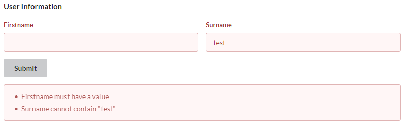
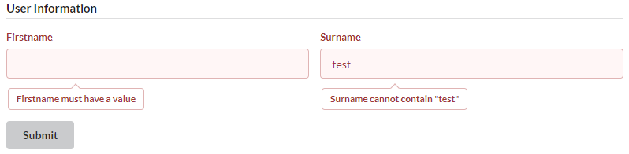

```{r, include = FALSE}
knitr::opts_chunk$set(
  collapse = TRUE,
  comment = "#>",
  eval = FALSE
)
```

## Overview

Input validation is a key part of shiny applications. If a user is able to add open text input, then it is likely someone will end up entering something that will crash the application. For example incorrectly writing an e-mail address or adding an extra . in a number.

Normally, an application will handle validating the inputs on the server side in R, but it can be cumbersome writing conditions for every possibility and writing an informative message for each potential issue.

Fomantic UI have included a [form validation component](https://fomantic-ui.com/behaviors/form.html) within their framework which easily does the required checks within the UI, meaning little/no work required on your end.

## Basic Usage

To add form validation to a Fomantic UI application:

1. Create a `shiny.semantic::form`, adding a set of inputs and giving the `form` element a unique ID

2. Within `form`, include an extra argument, `form_validation`, using the same ID as the `form` it is in

3. Add a series of `field_validation`, each containing a set of `field_rule`, making sure the IDs match the inputs

4. Any server-side functionality relying on the inputs in the form, replace `reactive(...)` with `eventReactive(input$<form_id>_submit, ...)` (and same with `observe` and `observeEvent`), as the submit button will only run if the form validation is successful

In-depth documentation is available for each form validation function.

## Example 

Using the [form validation example](https://github.com/Appsilon/shiny.semantic/tree/main/inst/examples/form_validation), we can see the following in the UI:

```
shiny.semantic::form(
  id = "form",
  h4(class = "ui dividing header", "User Information"),
  shiny.semantic::fields(
    class = "two",
    shiny.semantic::field(
      tags$label("Firstname"),
      shiny.semantic::text_input("firstname", value = "", type = "text")
    ),
    shiny.semantic::field(
      tags$label("Surname"),
      shiny.semantic::text_input("surname", value = "", type = "text")
    )
  ),
  fomantic.plus::form_validation(
    id = "form",
    fomantic.plus::field_validation(
      "firstname",
      fomantic.plus::field_rule("empty")
    ),
    fomantic.plus::field_validation(
      "surname",
      fomantic.plus::field_rule("empty"),
      fomantic.plus::field_rule("doesntContain", value = "test")
    )
  )
)
```

{alt="Screenshot of app, with error message displayed in a message box under the form" width="100%"}

The form itself looks like any standard form in `{shiny.semantic}`, with an exception that we have included an ID to the form. This is important for the validation to know which form to validate.

The validation above is looking for the following:

- The firstname input is not empty
- The lastname input is not empty **and** does not include the word "test"

If all conditions pass, then the button will enable events to be run server-side, otherwise an error message will appear in the UI (as above) telling the user all of the mistakes that have been made. Including a label for each input is important, as this is how the validation messages will return useful messages to the user.

If you would rather have the message next to the wrong input rather than a message box use `inline = TRUE`.

{alt="Screenshot of app, with error message displayed as a tooltip under the inputs" width="100%"}

## Validation Rules

There are two types of rule, ones that require a value, and ones that don't require a value. 

The following rules **do not** require a value:

- `"empty"` - Checks that a certain input is not empty
- `"checked"` - Checks that a checkbox input has been checked
- `"email", "url", "creditCard"` - Checks that an input is in a specific format
- `"number", "decimal", "integer"` - Checks that a number is any numeric value. **NB** even though these are numeric values, they must still be `text_input`s
  - Numeric inputs can also check values are within a range, in this case a value is included in the format `"x..y"` where `x` is the minimum value and `y` is the maximum value
  
The following rules **do** require a value: 

- `"regExp"` - Matches input against a regular expression
- `"contains", "doesntContain", "containsExactly", "doesntContainExactly"` - Matches input against a fixed string
- `"is", "not", "isExactly", "notExactly"` - Matches input exactly against a fixed string
  - When `"Exactly"` is included, the term is case sensitive, otherwise it is case insensitive
- `"minLength", "exactLength", "maxLength"` - Checks the number of characters used in an input
- `"match", "different"` - Matches the input against another input the form
- `"minCount", "exactCount", "maxCount"` - Checks the number of selections made in a multiple select input

For a list of all available rules, check the details section in `?fomantic.plus::field_rule` or the [Fomantic UI Website](https://fomantic-ui.com/behaviors/form.html#validation-rules)

## Custom Messages

The validation messages from Fomantic are pretty clear, but if you want to write a more specific message then that is possible using the `prompt` argument in `field_rule`. 

For example if you require a password with a non-word character you might use:

```
field_rule(
  "regExp", 
  prompt = "Password must contain at least one special character", 
  value = "\\W"
)
```

There are also some special phrases that can be used for more dynamic prompts:

- `{name}` - 	The current text of a field's label, or if no label available its placeholder text
- `{identifier}` - The identifier used to match the field
- `{value}` - The current field value
- `{ruleValue}` - The value passed to a rule, for example `field_rule("minLength", value = 100)` would set this value to 100

### Example

```
field_rule(
  "is", 
  prompt = "You entered {value}, we were looking for {ruleValue}", 
  value = "right"
)
```

## Submit Button

The submit button in `form_validation` is just like any other Fomantic UI button, but behaves slightly differently to the standard `shiny.semantic::action_button`. When a normal `action_button` is clicked, then it will always trigger an event on the server-side. When a button in `form_validation` is clicked, it will run all of the validation, and only if it passes all checks will it trigger the server-side events.

The button id is the form id + "_submit". This is to prevent duplicate ids between the form itself and the button.

