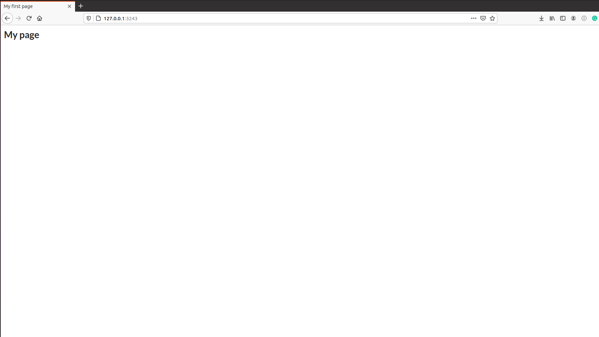

```{r setup, include = FALSE, screenshot.force = FALSE}
knitr::opts_chunk$set(
  echo = TRUE,
  collapse = TRUE,
  comment = "#>"
)
library(shiny)
library(shiny.semantic)
```

## Create UI inside documents
This is how you generate your first UI with `shiny.semantic`:

```{r echo=T, include = T, screenshot.force = FALSE}
uirender(
  shiny::tagList(
    h4("Numeric input", icon("world")),
    shiny.semantic::numeric_input("input", value = 0, label = ""),
    shiny.semantic::list_container(list(
        list(header = "Item 1", description = "My text for item 1", icon = "cat"),
        list(header = "Item 2", description = "My text for item 2", icon = "tree"),
        list(header = "Item 3", description = "My text for item 3", icon = "dog")
      ), is_divided = TRUE
    )
  ),
width = "200px", height = "280px")
```

## Create a simple Shiny App
Let's create a Shiny app with `semanticPage()` and just an `h1` title.



```{r echo=TRUE, include=TRUE, eval=FALSE, screenshot.force = FALSE}
ui <- semanticPage(
  title = "My first page",
  h1("My page")
)

server <- function(input, output, session) {}

shinyApp(ui, server)
```

### Built-in layouts

Now let's add sidebar layout `sidebar_layout()` with a sidebar panel `sidebar_panel()` and main panel `main_panel()`. The sidebar is displayed with a distinct background color and typically contains input controls. The main area occupies 2/3 of the horizontal width and typically contains outputs.


```{r echo=TRUE, include=TRUE, eval=FALSE, screenshot.force = FALSE}
ui <- semanticPage(
  title = "My first page",
  h1("My page"),
  sidebar_layout(
    sidebar_panel(),
    main_panel()
    )
)

server <- function(input, output, session) {}

shinyApp(ui, server)
```

Next let's fill in the main panel `main_panel()` with a Fomantic (Semantic previously) UI segment containing 2 cards.


```{r echo=TRUE, include=TRUE, eval=FALSE, screenshot.force = FALSE}
ui <- semanticPage(
  title = "My first page",
  h1("My page"),
  sidebar_layout(
    sidebar_panel(),
    main_panel(
      segment(
         cards(
           class = "two",
           card(class = "red",
             div(class = "content",
                 div(class = "header", "Main title card 1"),
                 div(class = "meta", "Sub title card 1"),
                 div(class = "description", "More detail description card 1")
             )
           ),
           card(class = "blue",
             div(class = "content",
                 div(class = "header", "Main title card 2"),
                 div(class = "meta", "Sub title card 2"),
                 div(class = "description", "More detail description card 2")
                 )
             )
           )
         )
      )
    )
  )

server <- function(input, output, session) {}

shinyApp(ui, server)
```

Time to fill in sidebar `sidebar_panel()`, so let's add a dropdown. We create it input using `dropdown_input()`.


```{r echo=TRUE, include=TRUE, eval=FALSE, screenshot.force = FALSE}
ui <- semanticPage(
  title = "My first page",
  h1("My page"),
  sidebar_layout(
    sidebar_panel(
      dropdown_input("mtcars_dropdown", c("mpg", "cyl", "disp", "hp"), value = "mpg"),
      textOutput("dropdown")
    ),
    main_panel(
      segment(
         cards(
           class = "two",
           card(class = "red",
             div(class = "content",
                 div(class = "header", "Main title card 1"),
                 div(class = "meta", "Sub title card 1"),
                 div(class = "description", "More detail description card 1")
             )
           ),
           card(class = "blue",
             div(class = "content",
                 div(class = "header", "Main title card 2"),
                 div(class = "meta", "Sub title card 2"),
                 div(class = "description", "More detail description card 2")
             )
           )
         )
      )
      )
    )
)

server <- function(input, output, session) {
  output$dropdown <- renderText(input$mtcars_dropdown)
}

shinyApp(ui, server)
```

Let's make dropdown do something and generate a histogram and a simple plot from a selected `mtcars` column using dropdown.


```{r echo=TRUE, include=TRUE, eval=FALSE, screenshot.force = FALSE}
ui <- semanticPage(
  title = "My first page",
  h1("My page"),
  sidebar_layout(
    sidebar_panel(
      p("Select variable for plots:"),
      dropdown_input("mtcars_dropdown", c("mpg", "cyl", "disp", "hp"), value = "mpg")
    ),
    main_panel(
      segment(
         cards(
           class = "two",
           card(class = "red",
             div(class = "content",
                 div(class = "header", "Main title card 1"),
                 div(class = "meta", "Sub title card 1"),
                 div(class = "description", "More detail description card 1")
             )
           ),
           card(class = "blue",
             div(class = "content",
                 div(class = "header", "Main title card 2"),
                 div(class = "meta", "Sub title card 2"),
                 div(class = "description", "More detail description card 2")
             )
           )
         )
      ),
      plotOutput("histogram"),
      plotOutput("plot")
      )
    )
)

server <- function(input, output, session) {
  output$dropdown <- renderText(input$mtcars_dropdown)
  output$histogram <- renderPlot(hist(mtcars[[input$mtcars_dropdown]]))
  output$plot <- renderPlot(plot(mtcars[[input$mtcars_dropdown]]))
}

shinyApp(ui, server)
```

There is more layouts that you can use. Just check the documentation of: `splitLayout`,
`flow_layout`, `vertical_layout` and some more!

###  Grid templates

Finally let's change the layout of the plots on the page and make them appear next to each other. We will use `grid()` for it and define a grid template using `grid_template()` with 1 row and 2 columns of the same size. Our grid template will contain 2 areas `chart1` and `chart2`

```{r echo=TRUE, include=TRUE, eval=FALSE, screenshot.force = FALSE}
grid_charts <- grid_template(
  default = list(areas = rbind(c("chart1", "chart2")),
                 rows_height = c("100%"),
                 cols_width = c("50%", "50%"))
)
```

We assign plots' outputs `plotOutput()` to both areas inside the `grid` function.

This is the final effect of our work:


```{r echo=TRUE, include=TRUE, eval=FALSE, screenshot.force = FALSE}
ui <- semanticPage(
  title = "My first page",
  h1("My page"),
  sidebar_layout(
    sidebar_panel(
      p("Select variable for plots:"),
      dropdown_input("mtcars_dropdown", c("mpg", "cyl", "disp", "hp"), value = "mpg")
    ),
    main_panel(
      segment(
         cards(
           class = "two",
           card(class = "red",
             div(class = "content",
                 div(class = "header", "Main title card 1"),
                 div(class = "meta", "Sub title card 1"),
                 div(class = "description", "More detail description card 1")
             )
           ),
           card(class = "blue",
             div(class = "content",
                 div(class = "header", "Main title card 2"),
                 div(class = "meta", "Sub title card 2"),
                 div(class = "description", "More detail description card 2")
             )
           )
         )
      ),
      grid(grid_charts,
           chart1 = plotOutput("histogram"),
           chart2 = plotOutput("plot")
         )
      )
    )
)

server <- function(input, output, session) {
  output$dropdown <- renderText(input$mtcars_dropdown)
  output$histogram <- renderPlot(hist(mtcars[[input$mtcars_dropdown]]))
  output$plot <- renderPlot(plot(mtcars[[input$mtcars_dropdown]]))
}

shinyApp(ui, server)
```

You can define grids for different screen sizes. [Here](https://github.com/Appsilon/shiny.semantic/blob/develop/examples/grid/app.R) is an example on how to define
it for mobile.
